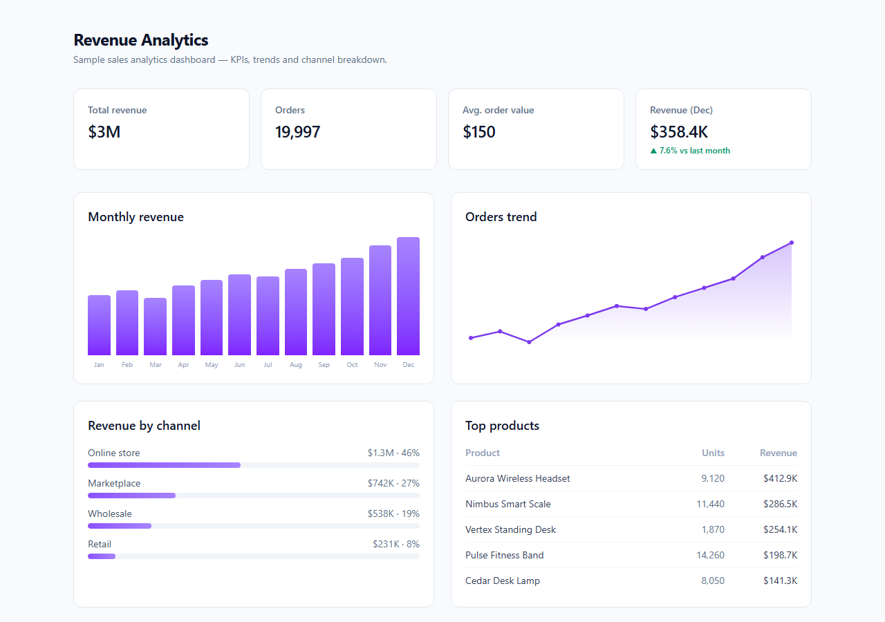

<!-- ══════════════════════════ PORTADA ══════════════════════════ -->
<div align="center">
  
</div>

<br/>

<!-- ══════════════════════ IDIOMAS / LANGUAGES ══════════════════════ -->
<div align="center">
<a href="README.md"></a>
<a href="README.en.md"></a>
<a href="README.es.md"></a>
</div>

<br/>

<div align="center">


</div>

<div align="center">
<a href="#acerca-de"></a>
<a href="#funcionalidades"></a>
<a href="#estructura"></a>
<a href="#uso"></a>
</div>

<br/>

> 💡 **Cero dependencia de charting.** Cada gráfico es SVG/CSS puro — bundle pequeño, renderizado nítido.

<div align="center">
  
</div>

## Acerca de

**Revenue Analytics** es un dashboard limpio de analytics de ventas — KPIs, tendencias de ingresos y desglose por canal — construido con Next.js 16, React 19, TypeScript y Tailwind CSS. Los gráficos están hechos a mano en SVG/CSS puro (sin librería de charts), manteniendo el bundle pequeño y el renderizado nítido.

## Funcionalidades

- **Tarjetas de KPI** — ingreso total, pedidos, ticket promedio, crecimiento MoM.
- **Gráfico de barras** de ingreso mensual y **gráfico de línea** de tendencia de pedidos (SVG).
- **Desglose de ingresos por canal** y tabla de **productos más vendidos**.
- **API propia** en `/api/summary` (route handler) — reemplázala por una fuente de datos real sin tocar la UI.

## Estructura

```
src/
  app/
    page.tsx              # dashboard (server component)
    api/summary/route.ts  # endpoint de datos
  components/             # Kpi, RevenueBars, TrendLine, ChannelSplit
  lib/                    # types, datos de demo, helpers de formato
```

## Uso

```bash
npm install
npm run dev      # http://localhost:3000
```

## Licencia

[MIT](LICENSE).

<div align="center">
  
</div>

<p align="center"><sub>Desarrollado por <strong><a href="https://github.com/geoggrigori">Grigori</a></strong> · 2026</sub></p>
